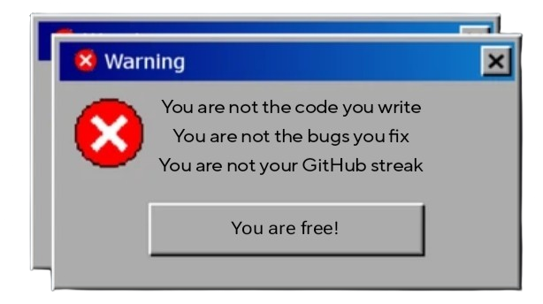

##   Status - 

  

<table>
  <tr>
    <td>
      
    </td>
    <td>
      
    </td>
  </tr>
</table>

<table>
  <tr>
    <td width="60%">
      

  

    </td>
    <td>
 

  

    </td>
  </tr>
</table>

