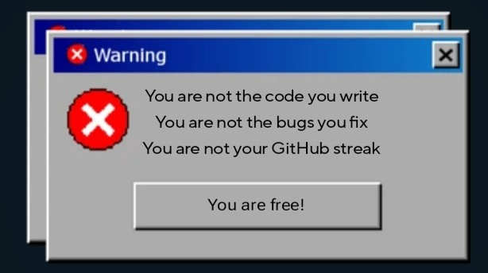

<h1 align="center">Hi there👋, I'm Kushagra</h1>

## Languages and Tools: 

  

<table>
  <tr>
    <td>
      
    </td>
    <td>
      
    </td>
  </tr>
</table>

  

  ## Trophies:
  
 
     
  

  

